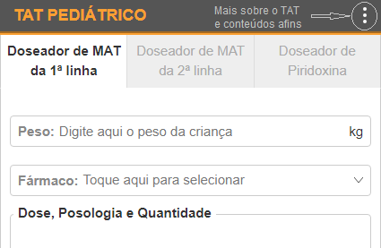

# TAT Pediátrico

O **TAT Pediátrico** é um serviço online gratuito que, de acordo com o peso inserido pelo usuário, doseia automaticamente medicamentos anti-tuberculose (MAT) e Piridoxina. Tem como referência o guião de [Avaliação e manejo de pacientes com Tuberculose, Protocolos Nacionais, 2019](sources/guiao-avaliacao-e-manejo-de-pacientes-com-tb-2019.pdf) que, até a altura da publicação do TAT (Agosto/2024), ainda estava em vigor no Serviço Nacional de Saúde (SNS) em Moçambique.

O TAT Pediátrico é composto por 3 abas principais, respectivamente:

1. Doseador de MATs da 1ª linha;
2. Doseador de MATs da 2ª linha;
3. Doseador de Piridoxina.

O Doseador está basicamente estruturado da seguinte forma:

* Um campo com o rótulo **Peso**, para inserir o peso em quilograma(s) da criança para a qual você pretende calcular a dose;

* **Fármaco**, campo de seleção com os fármacos anti-TB da 1ª linha, 2ª linha ou Piridoxina. Clique no campo para abrir a lista e em seguida, selecione o fármaco do qual pretende calcular a dose.

* **Dose, Posologia e Quantidade**: secção de saída em que são automaticamente mostradas, numa mini-tabela, a dose, posologia e quantidade de comprimidos a dispensar (para 14 e 28 dias) do fármaco selecionado de acordo com o peso inserido;

* **Notas e Precauções***: secção de saída em que são mostradas recomendações, interações medicamentosas, entre outras informações pertinentes acerca do fármaco selecionado.